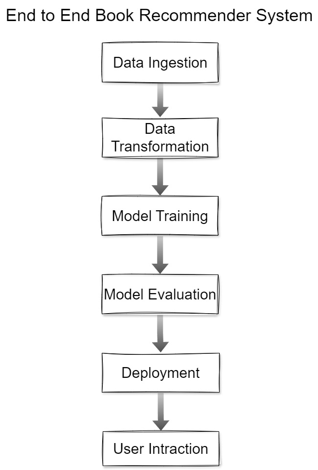

# End-to-End-Book-Recommender-System

## Types of recommendation systems


### 📘 End-to-End Book Recommender System – Workflow Overview




#### Data Ingestion

- Read raw datasets (e.g., books, users, ratings) from the artifacts/dataset/ directory.

- Utilize the DataIngestion component to load and preprocess data.​

#### Data Transformation

- Clean and merge datasets.

- Perform feature engineering (e.g., compute average ratings, filter popular books).

- Prepare data for recommendation algorithms.​

#### Model Training

- Implement recommendation algorithms (e.g., collaborative filtering, content-based filtering).

- Train models using the processed data.

- Save trained models to the artifacts/ directory.​

#### Model Evaluation

- Evaluate model performance using appropriate metrics (e.g., RMSE, precision, recall).

- Fine-tune models based on evaluation results.​

#### Deployment

- Develop a web application using app.py to serve recommendations.

- Containerize the application using Docker (Dockerfile provided).

- Deploy the application for end-users to interact with.​

#### User Interaction

- Users input their preferences or select books.

- The system provides personalized book recommendations based on user input


### Workflow
- config.yaml
- entity
- config/configuration.py
- components
- pipeline
- main.py
- app.py

## How to run?
### STEPS

### STEP 1. Clone the repository

Open terminal, and execute the git clone command. 

```bash 
git clone https://github.com/anulsasidharan/End-to-End-Book-Recommender-System.git
```

### STEP 2. Create a conda enveronment after opening the repository and activate it

```bash
conda create -n books python =3.12.7 -y
```

```bash
conda activate books
```

### To check the env created or not, just list the conda enveronments. 
    
```bash
conda env list
```

### STEP 3. Install the requirements

```bash
pip install -r requirements.txt
```

To run  the streamlit app
```bash
streamlit run app.py
```